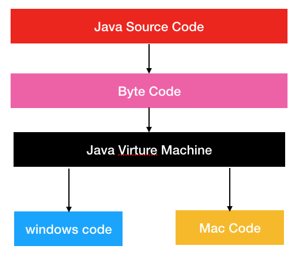
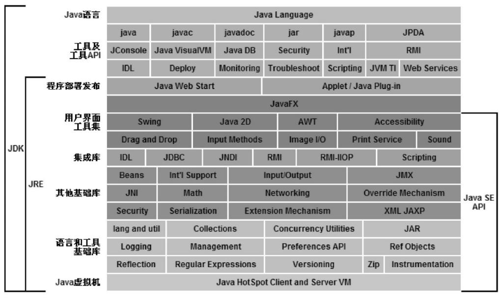
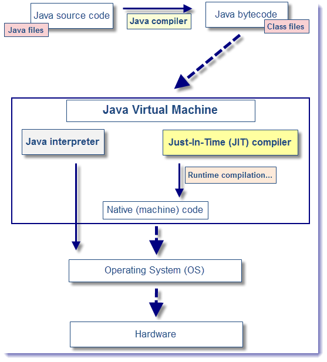
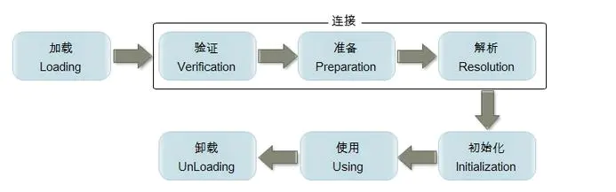
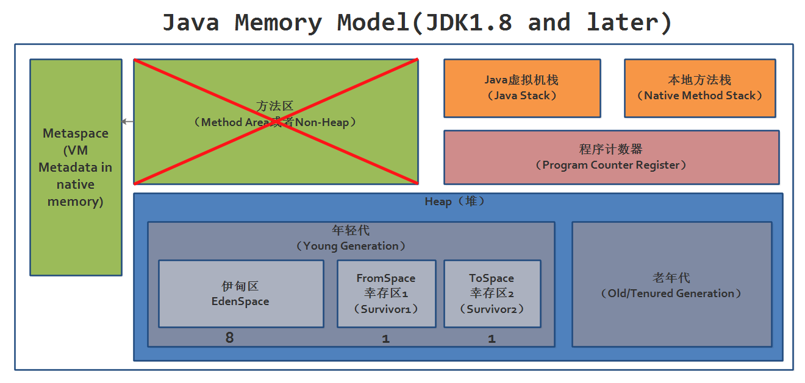
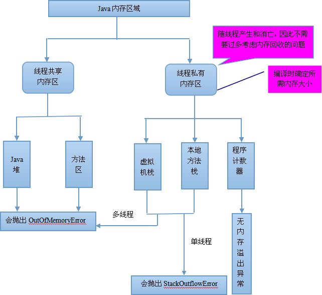
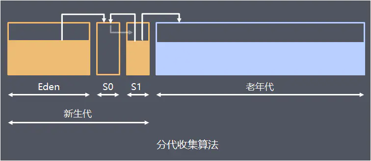

# JVM原理入门

> tzh 2020/05/19./

<!-- TOC -->

- [JVM原理入门](#jvm原理入门)
  - [Why JVM](#why-jvm)
  - [Why Java](#why-java)
    - [Java、JDK、JRE](#javajdkjre)
  - [JVM 概论](#jvm-概论)
    - [什么是 JVM](#什么是-jvm)
  - [JVM 概览](#jvm-概览)
    - [前端编译/Class 文件](#前端编译class-文件)
      - [Class 文件结构](#class-文件结构)
    - [后端编译](#后端编译)
    - [虚拟机类加载机制](#虚拟机类加载机制)
      - [加载](#加载)
      - [验证](#验证)
      - [准备](#准备)
      - [解析](#解析)
      - [初始化](#初始化)
      - [使用](#使用)
      - [卸载](#卸载)
  - [内存/堆/GC](#内存堆gc)
    - [私有](#私有)
      - [程序计数器](#程序计数器)
      - [Java 虚拟机栈 + 本地方法栈](#java-虚拟机栈--本地方法栈)
    - [公有](#公有)
      - [方法区 + 常量池](#方法区--常量池)
      - [堆](#堆)
        - [堆的分布](#堆的分布)
        - [GC 词汇](#gc-词汇)
        - [一般性的GC流程](#一般性的gc流程)
        - [一般性的 YGC/FGC](#一般性的-ygcfgc)
        - [堆内存的具体分布](#堆内存的具体分布)
          - [为什么有两个 Survivor 区](#为什么有两个-survivor-区)
    - [直接内存](#直接内存)
  - [常用命令](#常用命令)
    - [k8s 上极其方便的玩法](#k8s-上极其方便的玩法)
    - [jps](#jps)
    - [jinfo](#jinfo)
    - [jstat](#jstat)
      - [YGC 和 Survivor](#ygc-和-survivor)
        - [Thoughts](#thoughts)
    - [jmap](#jmap)
    - [jstack](#jstack)
  - [Slipstream 常用分析 (待续)](#slipstream-常用分析-待续)
  - [作业](#作业)
  - [Ref](#ref)

<!-- /TOC -->

## Why JVM

以下问题很是让人头疼?

- 内存溢出?
- GC FGC YGC?
- server 没响应 4040页面上不去?
- executor 一跑就挂executor lost?
- beeline 作业提交不上去?
- ......

你必须学会看懂日志吧。那么你就必须要看得懂 GC 日志，这是 Java 虚拟机内容的一部分。你看懂了 GC 日志，那么你就得明白什么是年轻代、老年代、永久代、元数据区等，这些就是 Java 虚拟机的内存模型。你懂了 Java 虚拟机的内存模型，那你就得知道 Java 虚拟机是如何进行垃圾回收的，它们使用的垃圾回收算法是怎样的，它们有何优缺点。接下来就是各种垃圾回收器的特性......

## Why Java

Java 出生时主要解决的两个问题:

- 一次编写, 到处运行 (Write once, run anywhere)
- 相对安全的内存管理和访问机制, 避免了大部分内存泄露和指针越界(语言往人这边更加偏向化)

以前程序员写代码需要分平台, 在linux能跑的代码放到win上面就跑不了了. 然后C/C++自己申请内存还得自己自己free. 讲白了就是你手里的代码是跟机器又远了一步, 跟概念抽象又近了一步.

比方说, 你写了一个 hello world 的 C程序, 在linux编译完后的可执行文件是不可以在windows运行的. (generally) 但是你没听说写一段 Java 代码还分 windows/linux 吧. 这就是 JVM 的优势了.



### Java、JDK、JRE

Java 社区把 Java技术体系 分为以下四个部分:

- Java 程序设计语言
- 各种平台款式的 JVM (java -verion)
- Class 文件格式
- Java API 类库 + 第三方类库



JRE = Java Runtime Environment = JVM + Java 核心类库. 支持 Java 程序运行的标准环境

JDK = JRE + 开发、诊断工具. 用于支持 Java 程序开发的最小环境

## JVM 概论

### 什么是 JVM

JVM，全称Java Virtual Machine，英文为Java虚拟机，简单的探讨一下虚拟机这三个字，对后面的学习也是挺舒服的。百度百科描述说，“虚拟机（Virtual Machine）指通过软件模拟的具有完整硬件系统功能的、运行在一个完全隔离环境中的完整计算机系统”，但是虚拟机本质还是该计算机系统的一个进程，可以类比香港澳门具有高度自治，但本质上他们还是属于中国的。为了方便描述，我们把整个计算机当成一幢大楼，而虚拟机则是某一个楼层。大楼划分了一个区域给一个楼层，让这个楼层自己管理自己，也就对应着，计算机划分了一个内存给JVM，让JVM自己管理自己。

与其他语言不同，Java 语言并不直接将代码编译成与系统有关的机器码，而是编译成一种特定的语言规范，这种语言规范我们称之为字节码。无论 Java 程序要在 Windows 系统，还是 Mac OSX 系统，抑或是 Linux 系统，它首先都得编译成字节码文件，之后才能运行。

但即使编译成字节码文件了，各个系统还是无法明白字节码文件的内容，这时候就需要 **Java 虚拟机**的帮助了。Java 虚拟机会解析字节码文件的内容，并将其翻译为各操作系统能理解的机器码。



Java的程序编译的最终样子是.class文件，不同虚拟机的对每一个.class文件的翻译结果都是一致的。而对于C／C++而言，编译生成的是纯二进制的机器指令，是直接面对计算机系统的内存，但是，java程序的编译结果是面向JVM，是要交付给JVM，让他再做进一步处理从而让计算机识别运行，这就是所谓的“屏蔽掉各种硬件和操作系统的内存访问差异”。

## JVM 概览

> 代码编译的结果从本地机器码转变为字节码, 是储存格式发展的一小步, 确实编程语言发展的一大步

### 前端编译/Class 文件

```java
public class Helloworld{
	public static void main(String[] args) {
		System.out.println("hello world");
	}
}
```

```shell
javac Helloworld.java

ll
Helloworld.java
// 二进制的字节码
Helloworld.class

[root@linux-pm-0-37 tzh]# java Helloworld

hello world
```

我们运行 javac 命令的过程，其实就是 javac 编译器解析 Java 源代码，并生成字节码文件的过程。说白了，其实就是使用 javac 编译器把 Java 语言规范转化为字节码语言规范。javac 编译器的处理过程可以分为下面四个阶段：

**第一个阶段**：词法、语法分析。在这个阶段，JVM 会对源代码的字符进行一次扫描，最终生成一个抽象的语法树。简单地说，在这个阶段 JVM 会搞懂我们的代码到底想要干嘛。就像我们分析一个句子一样，我们会对句子划分主谓宾，弄清楚这个句子要表达的意思一样。

**第二个阶段**：填充符号表。我们知道类之间是会互相引用的，但在编译阶段，我们无法确定其具体的地址，所以我们会使用一个符号来替代。在这个阶段做的就是类似的事情，即对抽象的类或接口进行符号填充。等到类加载阶段，JVM 会将符号替换成具体的内存地址。

**第三个阶段**：注解处理。我们知道 Java 是支持注解的，因此在这个阶段会对注解进行分析，根据注解的作用将其还原成具体的指令集。

**第四个阶段**：分析与字节码生成。到了这个阶段，JVM 便会根据上面几个阶段分析出来的结果，进行字节码的生成，最终输出为 class 文件。

#### Class 文件结构

- 魔数与Class文件版本
- 常量池
- 访问标志
- 类索引、父类索引、接口索引
- 字段表集合
- 方法表集合
- 属性表集合

### 后端编译

AOT: Ahead of Time, 运行前编译

JIT: Just in Time, 动态(即时)编译，边运行边编译

这两种方式的区别在于，前者启动速度快但运行速度慢，而后者启动速度慢但运行速度快。至于为什么会这样，其原因很简单。因为解释器不需要像 JIT 编译器一样，将所有字节码都转化为机器码，自然就少去了优化的时间。而当 JIT 编译器完成第一次编译后，其会将字节码对应的机器码保存下来，下次可以直接使用。而我们知道，机器码的运行效率肯定是高于 Java 解释器的。所以在实际情况中，为了运行速度以及效率，我们通常采用两者相结合的方式进行 Java 代码的编译执行。

所以一般都是默认两种一起上.

```shell
[root@linux-pm-0-37 tzh]# java -version
java version "1.8.0_191"
Java(TM) SE Runtime Environment (build 1.8.0_191-b12)
Java HotSpot(TM) 64-Bit Server VM (build 25.191-b12, mixed mode)


[root@linux-pm-0-37 tzh]# java -Xcomp -version
java version "1.8.0_191"
Java(TM) SE Runtime Environment (build 1.8.0_191-b12)
Java HotSpot(TM) 64-Bit Server VM (build 25.191-b12, compiled mode)


[root@linux-pm-0-37 tzh]# java -Xint -version
java version "1.8.0_191"
Java(TM) SE Runtime Environment (build 1.8.0_191-b12)
Java HotSpot(TM) 64-Bit Server VM (build 25.191-b12, interpreted mode)
```

### 虚拟机类加载机制

JVM 把描述类的数据从 Class 文件加载到内存, 并对数据进行校验、转换解析、初始化等最终形成能被虚拟机直接使用的 Java类型, 这个过程叫做虚拟机的类加载机制.

当我们的Java代码编译完成后，会生成对应的 class 文件。接着我们运行java Demo命令的时候，我们其实是启动了JVM 虚拟机执行 class 字节码文件的内容。而 JVM 虚拟机执行 class 字节码的过程可以分为七个阶段：**加载、验证、准备、解析、初始化、使用、卸载**。



#### 加载

1. 通过一个类的全限定名(源文件中的全新定名是包名加类名， 包名的各个部分之间，包名和类名之间， 使用点号分割。 如Object类， 在源文件中的全限定名是java.lang.Object )获取定义此类的二进制字节流
2. 将该二进制字节流所代表的静态储存结构转化为 方法区(Method Area) 运行时的数据结构
3. 在内存中生成一个代表这个类的 java.lang.Class 对象, 作为方法区这个类的各种数据的访问入口

加载用的类加载器classloader 分为 **启动类加载器** sun.boot.class.path 控制(jinfo 可看) 和 **其他加载器**.

**注意**: 对于任何一个类, 都必须由它的类加载器和这个类本身一起确定在 JVM 的唯一性. inceptor 有个问题: 不支持动态更新UDF. 就是由于用了同一个classloader + UDF 全限定名未改(可能曾加载到method area并且未清掉) 而导致JVM无法确定udf行为不可测.

WARP-27681 TDH 6.0.1, TDH 6.1, TDH 5.2.3支持不重启服务更新udf jar包
drop permanent function kafka_demo with resource;
create permanent function kafka_demo as 'io.transwarp.udf.KafkaUDF' using jar 'file:///home/wangcheng/marason/udf/udf/target/kafka.jar';

#### 验证

当 JVM 加载完 Class 字节码文件并在方法区创建对应的 Class 对象之后，JVM 便会启动对该字节码流的校验，只有符合 JVM 字节码规范的文件才能被 JVM 正确执行。这个校验过程大致可以分为下面几个类型：

JVM规范校验。JVM 会对字节流进行文件格式校验，判断其是否符合 JVM 规范，是否能被当前版本的虚拟机处理。例如：文件是否是以 0x cafe bene开头，主次版本号是否在当前虚拟机处理范围之内等。
代码逻辑校验。JVM 会对代码组成的数据流和控制流进行校验，确保 JVM 运行该字节码文件后不会出现致命错误。例如一个方法要求传入 int 类型的参数，但是使用它的时候却传入了一个 String 类型的参数。一个方法要求返回 String 类型的结果，但是最后却没有返回结果。代码中引用了一个名为 Apple 的类，但是你实际上却没有定义 Apple 类。
当代码数据被加载到内存中后，虚拟机就会对代码数据进行校验，看看这份代码是不是真的按照JVM规范去写的。这个过程对于我们解答问题也没有直接的关系，但是了解类加载机制必须要知道有这个过程。

#### 准备

当完成字节码文件的校验之后，JVM 便会开始为类变量分配内存并初始化。这里需要注意两个关键点，即内存分配的对象以及初始化的类型。

内存分配的对象。Java 中的变量有「类变量」和「类成员变量」两种类型，「类变量」指的是被 static 修饰的变量，而其他所有类型的变量都属于「类成员变量」。在准备阶段，JVM 只会为「类变量」分配内存，而不会为「类成员变量」分配内存。「类成员变量」的内存分配需要等到初始化阶段才开始。
例如下面的代码在准备阶段，只会为 factor 属性分配内存，而不会为 website 属性分配内存。

public static int factor = 3;
public String website = "www.cnblogs.com/chanshuyi";
初始化的类型。在准备阶段，JVM 会为类变量分配内存，并为其初始化。但是这里的初始化指的是为变量赋予 Java 语言中该数据类型的零值，而不是用户代码里初始化的值。
例如下面的代码在准备阶段之后，sector 的值将是 0，而不是 3。

public static int sector = 3;
但如果一个变量是常量（被 static final 修饰）的话，那么在准备阶段，属性便会被赋予用户希望的值。例如下面的代码在准备阶段之后，number 的值将是 3，而不是 0。

public static final int number = 3;
之所以 static final 会直接被复制，而 static 变量会被赋予零值。其实我们稍微思考一下就能想明白了。

两个语句的区别是一个有 final 关键字修饰，另外一个没有。而 final 关键字在 Java 中代表不可改变的意思，意思就是说 number 的值一旦赋值就不会在改变了。既然一旦赋值就不会再改变，那么就必须一开始就给其赋予用户想要的值，因此被 final 修饰的类变量在准备阶段就会被赋予想要的值。而没有被 final 修饰的类变量，其可能在初始化阶段或者运行阶段发生变化，所以就没有必要在准备阶段对它赋予用户想要的值。

#### 解析

当通过准备阶段之后，JVM 针对类或接口、字段、类方法、接口方法、方法类型、方法句柄和调用点限定符 7 类引用进行解析。这个阶段的主要任务是将其在常量池中的符号引用替换成直接其在内存中的直接引用。

其实这个阶段对于我们来说也是几乎透明的，了解一下就好。

#### 初始化

到了初始化阶段，用户定义的 Java 程序代码才真正开始执行。在这个阶段，JVM 会根据语句执行顺序对类对象进行初始化，一般来说当 JVM 遇到下面 5 种情况的时候会触发初始化：

遇到 new、getstatic、putstatic、invokestatic 这四条字节码指令时，如果类没有进行过初始化，则需要先触发其初始化。生成这4条指令的最常见的Java代码场景是：使用new关键字实例化对象的时候、读取或设置一个类的静态字段（被final修饰、已在编译器把结果放入常量池的静态字段除外）的时候，以及调用一个类的静态方法的时候。
使用 java.lang.reflect 包的方法对类进行反射调用的时候，如果类没有进行过初始化，则需要先触发其初始化。
当初始化一个类的时候，如果发现其父类还没有进行过初始化，则需要先触发其父类的初始化。
当虚拟机启动时，用户需要指定一个要执行的主类（包含main()方法的那个类），虚拟机会先初始化这个主类。
当使用 JDK1.7 动态语言支持时，如果一个 java.lang.invoke.MethodHandle实例最后的解析结果 REF_getstatic,REF_putstatic,REF_invokeStatic 的方法句柄，并且这个方法句柄所对应的类没有进行初始化，则需要先出触发其初始化。
看到上面几个条件你可能会晕了，但是不要紧，不需要背，知道一下就好，后面用到的时候回到找一下就可以了。

#### 使用

当 JVM 完成初始化阶段之后，JVM 便开始从入口方法开始执行用户的程序代码。这个阶段也只是了解一下就可以。

#### 卸载

当用户程序代码执行完毕后，JVM 便开始销毁创建的 Class 对象，最后负责运行的 JVM 也退出内存。这个阶段也只是了解一下就可以。

## 内存/堆/GC

> Java 和 C++ 有一堵由内存动态分配和垃圾收集技术所围成的高墙, 墙外的人想进来, 墙内的人却想出来

现在对于一个 Java 源文件是如何变成字节码文件，以及字节码文件的含义已经非常清楚了。那么接下来就是让 Java 虚拟机运行字节码文件，从而得出我们最终想要的结果了。在这个过程中，Java 虚拟机会加载字节码文件，将其存入 Java 虚拟机的内存空间中，之后进行一系列的初始化动作，最后运行程序得出结果。

根据《Java 虚拟机规范》中的说法，Java 虚拟机的内存结构可以分为**公有**和**私有**两部分。公有指的是所有线程都共享的部分，指的是 Java 堆、方法区、常量池。私有指的是每个线程的私有数据，包括：PC寄存器、Java 虚拟机栈、本地方法栈。



### 私有

#### 程序计数器

程序计数器: Program Counter Register, 是一块很小的内存空间(没有规定OOM), 可以看做是当前线程所执行的字节码的行号指示器. 字节码解释器在工作时就是改变计数器的值来选取下一条需要执行的字节码指令, 分支、循环、跳转、异常处理、线程恢复都依赖这个计数器.

为什么是私有?

这是由于 JVM 的多线程是通过线程轮流切换、分配处理器执行时间的方式实现的, 在任意一个确定的时间, 一个处理器(多核处理器就是一个核)只会执行一条线程中的指令. 所以切换后要能回到原位, 每条线程都有独立的程序计数器.

#### Java 虚拟机栈 + 本地方法栈

java虚拟机栈是线程私有的，他与线程的声明周期同步。 虚拟机栈描述的是java方法执行的线程内存模型，每个方法执行都会创建一个栈帧，栈帧包含局部变量表、操作数栈、动态连接、方法出口等。(规定了 OOM + StackOverflow)

**注意**: 一条n长的SQL可能会导致 StackOverflow , 可以通过调整 xss (默认64位为 1024k) HotSpot 虚拟机将 Java 虚拟机栈 + 本地方法栈 放在一起, 只能通过 xss 一起调节

```shell
[root@linux-pm-0-37 tzh]# java -XX:+PrintFlagsFinal -version | grep ThreadStackSize
     intx CompilerThreadStackSize                   = 0                                   {pd product}
     intx ThreadStackSize                           = 1024                                {pd product}
     intx VMThreadStackSize                         = 1024                                {pd product}
java version "1.8.0_191"
Java(TM) SE Runtime Environment (build 1.8.0_191-b12)
Java HotSpot(TM) 64-Bit Server VM (build 25.191-b12, mixed mode)
```

当 Java 虚拟机使用其他语言（例如 C 语言）来实现指令集解释器时，也会使用到本地方法栈。如果 Java 虚拟机不支持 natvie 方法，并且自己也不依赖传统栈的话，可以无需支持本地方法栈。

### 公有

线程公有的部分分为: 堆、方法区、常量池.

#### 方法区 + 常量池

**方法区**: Method Area, 指的是存储 Java 类字节码数据的一块区域，它存储了每一个类的结构信息，例如运行时常量池、字段和方法数据、构造方法等。可以看到常量池其实是存放在方法区中的，但《Java 虚拟机规范》将常量池和方法区放在同一个等级上，这点我们知晓即可。

方法区在不同版本的虚拟机有不同的表现形式，例如在 1.7 版本的 HotSpot 虚拟机中，方法区被称为永久代（Permanent Space），而在 JDK 1.8 中则被称之为 MetaSpace。

这是因为 JDK 1.8 之前, HotSpot 的设计团队选择把垃圾收集器的分代设计扩展到方法区, 或者说使用 永久代 来实现方法区, 从而免去专门编写内存管理代码. 由于可能这个设计不大舒服 (很容易出现OOM 等等原因)

JDK 1.8 将 方法区 的实现从 永久代 改成了 元空间MetaSpace. (从 -XX:MaxPermSize 变成 -XX:MetaspaceSize)

这里最大的区别在于, Metaspace 使用的是 直接内存(本地内存 Native Memory)

整个永久代有一个 JVM 本身设置固定大小上线，无法进行调整，而元空间使用的是直接内存，受本机可用内存的限制，并且永远不会得到java.lang.OutOfMemoryError。你可以使用 -XX：MaxMetaspaceSize 标志设置最大元空间大小，默认值为 unlimited，这意味着它只受系统内存的限制。-XX：MetaspaceSize 调整标志定义元空间的初始大小如果未指定此标志，则 Metaspace 将根据运行时的应用程序需求动态地重新调整大小。

**运行时常量池**: Runtime Constant Pool, 是方法区的一部分. 运行时常量池是方法区的一部分。Class 文件中除了有类的版本、字段、方法、接口等描述信息外，还有常量池信息（用于存放编译期生成的各种字面量和符号引用）

既然运行时常量池时方法区的一部分，自然受到方法区内存的限制，当常量池无法再申请到内存时会抛出 OutOfMemoryError 异常。

JDK1.7及之后版本的 JVM 已经将运行时常量池从方法区中移了出来，在 Java 堆（Heap）中开辟了一块区域存放运行时常量池。



#### 堆

> 自动内存管理根本上解决了: 自动给对象分配内存 + 自动回收分配给对象的内存

Java 虚拟机所管理的内存中最大的一块，Java 堆是所有线程共享的一块内存区域，在虚拟机启动时创建。此内存区域的唯一目的就是存放对象实例，几乎所有的对象实例以及数组都在这里分配内存。

Java 堆是垃圾收集器管理的主要区域，因此也被称作GC堆（Garbage Collected Heap）.

- 弱分代假说(Weak Generational Hypothisis): 绝大多数对象都是朝生夕灭
- 强分代假说(Strong Gernerational Hypothisis): 熬过越多次垃圾回收过程的对象就越难以消亡

##### 堆的分布



从垃圾回收的角度，由于现在收集器基本都采用分代垃圾收集算法，所以Java堆还可以细分为：新生代和老年代：再细致一点有：Eden空间、From Survivor、To Survivor空间等。进一步划分的目的是更好地回收内存，或者更快地分配内存.

注意: 垃圾回收会应为GC收集器、算法、配置不同而不同...只能谈个大概

##### GC 词汇

GC 分类:

针对HotSpot VM的实现，它里面的GC其实准确分类只有两大种：

Partial GC：并不收集整个GC堆的模式
    Young GC：只收集young gen的GC、Minor GC
    Old GC：只收集old gen的GC。只有CMS的concurrent collection是这个模式
    Mixed GC：收集整个young gen以及部分old gen的GC。只有G1有这个模式
Full GC：收集整个堆，包括young gen、old gen、perm gen/metaspace（如果存在的话）等所有部分的模式。

Major GC通常是跟full GC是等价的，收集整个GC堆。但因为HotSpot VM发展了这么多年，外界对各种名词的解读已经完全混乱了，当有人说“major GC”的时候一定要问清楚他想要指的是上面的full GC还是old GC。

我们只要关注: YGC/FGC 基本可以解决问题.

TODO/作业:

- [ ] server 和 executor 分别用了什么垃圾收集器?
- [ ] 基于什么垃圾收集理论? 什么 GC 算法?
- [ ] 优缺点是啥子

##### 一般性的GC流程


(GC收集器、配置、GC算法不同而不同)

新生代（Young Generation）：大多数对象在新生代中被创建，其中很多对象的生命周期很短。每次新生代的垃圾回收（又称Minor GC、Young GC）后只有少量对象存活(绝大多数对象都是朝生夕灭)，所以选用复制算法，只需要少量的复制成本就可以完成回收。

新生代内又分三个区：一个Eden区，两个Survivor区，大部分对象在Eden区中生成。当**Eden区满**时，还存活的对象将被复制到两个Survivor区（中的一个）。当这个**Survivor区满**时，此区的存活且不满足“晋升”条件的对象将被复制到另外一个Survivor区。对象每经历一次Minor GC，年龄加1，达到“晋升年龄阈值”后，被放到老年代，这个过程也称为“晋升”。显然，“晋升年龄阈值”的大小直接影响着对象在新生代中的停留时间，在Serial和ParNew GC两种回收器中，“晋升年龄阈值”通过参数MaxTenuringThreshold设定，默认值为15。
Survivor的存在意义，就是减少被送到老年代的对象，进而减少Full GC的发生，Survivor的预筛选保证，只有经历16次Minor GC还能在新生代中存活的对象，才会被送到老年代。
但这也不是一定的，对于一些较大的对象 ( 即需要分配一块较大的连续内存空间 ) 则是直接进入到老年代。

老年代（Old Generation）：在新生代中经历了N次垃圾回收后仍然存活的对象，就会被放到年老代，该区域中对象存活率高。老年代的垃圾回收（又称Major GC）通常使用“标记-清理”或“标记-整理”算法。整堆包括新生代和老年代的垃圾回收称为Full GC（HotSpot VM里，除了CMS之外，其它能收集老年代的GC都会同时收集整个GC堆，包括新生代）。

##### 一般性的 YGC/FGC

YGC的时机:

edn空间不足

FGC的时机：

1.old空间不足；

2.perm空间不足；(1.8 为 metaspace)

3.显示调用System.gc() ，包括RMI等的定时触发;

4.YGC时的悲观策略；

5.dump live的内存信息时(jmap –dump:live)。

对YGC的 触发时机，相当的显而易见，就是eden空间不足， 这时候就肯定会触发ygc

对于FGC的触发时机， old空间不足， 和perm的空间不足， 调用system.gc()这几个都比较显而易见，就是在这种情况下， 一般都会触发GC。

最复杂的是所谓的悲观策略，它触发的机制是在首先会计算之前晋升的平均大小，也就是从新生代，通过ygc变成新生代的平均大小，然后如果旧生代剩余的空间小于晋升大小，那么就会触发一次FullGC。考虑的策略是， 从平均和长远的情况来看，下次晋升空间不够的可能性非常大， 与其等到那时候在fullGC 不如悲观的认为下次肯定会触发FullGC， 直接先执行一次FullGC。而且从实际使用过程中来看， 也达到了比较稳定的效果。

##### 堆内存的具体分布


默认的，新生代 ( Young ) 与老年代 ( Old ) 的比例的值为 1:2 ( 该值可以通过参数 –XX:NewRatio 来指定 )，即：新生代 ( Young ) = 1/3 的堆空间大小。老年代 ( Old ) = 2/3 的堆空间大小。其中，新生代 ( Young ) 被细分为 Eden 和 两个 Survivor 区域，这两个 Survivor 区域分别被命名为 from 和 to，以示区分。
默认的，Edem : from : to = 8 : 1 : 1 ( 可以通过参数 –XX:SurvivorRatio 来设定 )，即： Eden = 8/10 的新生代空间大小，from = to = 1/10 的新生代空间大小。
JVM 每次只会使用 Eden 和其中的一块 Survivor 区域来为对象服务，所以无论什么时候，总是有一块 Survivor 区域是空闲着的。
因此，新生代实际可用的内存空间为 9/10 ( 即90% )的新生代空间。
From Survivor区域与To Survivor区域是交替切换空间，在同一时间内两者中只有一个不为空

```shell
–XX:SurvivorRatio 两个 Survivor区 和 eden区 的比值, 默认 8 我们未指定 survivor : eden = 2 : 8 
–XX:NewRatio 新生代和老年代的比值, 默认 4 新/老 = 1/4

-XX:MaxTenuringThreshold
  晋升年龄最大阈值，默认15。在新生代中对象存活次数(经过YGC的次数)后仍然存活，就会晋升到老年代。每经过一次YGC，年龄加1，当survivor区的对象年龄达到TenuringThreshold时，表示该对象是长存活对象，就会直接晋升到老年代。

-XX:TargetSurvivorRatio
  设定survivor区的目标使用率。默认50，即survivor区对象目标使用率为50%。

JVM会将每个对象的年龄信息、各个年龄段对象的总大小记录在“age table”表中。基于“age table”、survivor区大小、survivor区目标使用率（-XX:TargetSurvivorRatio）、晋升年龄阈值（-XX:MaxTenuringThreshold），JVM会动态的计算tenuring threshold的值。一旦对象年龄达到了tenuring threshold就会晋升到老年代。

  为什么要动态的计算tenuring threshold的值呢？假设有很多年龄还未达到TenuringThreshold的对象依旧停留在survivor区，这样不利于新对象从eden晋升到survivor。因此设置survivor区的目标使用率，当使用率达到时重新调整TenuringThreshold值，让对象尽早的去old区。

  如果希望跟踪每次新生代GC后，survivor区中对象的年龄分布，可在启动参数上增加-XX:+PrintTenuringDistribution.
```

最简单的分代式GC策略，按HotSpot VM的serial GC的实现来看，触发条件是：

young GC：当young gen中的eden区分配满的时候触发。注意young GC中有部分存活对象会晋升到old gen，所以young GC后old gen的占用量通常会有所升高。

full GC：当准备要触发一次young GC时，如果发现统计数据说之前young GC的平均晋升大小比目前old gen剩余的空间大，则不会触发young GC而是转为触发full GC（因为HotSpot VM的GC里，除了CMS的concurrent collection之外，其它能收集old gen的GC都会同时收集整个GC堆，包括young gen，所以不需要事先触发一次单独的young GC）；

或者，如果有perm gen的话，要在perm gen分配空间但已经没有足够空间时，也要触发一次full GC；或者System.gc()、heap dump带GC，默认也是触发full GC。HotSpot VM里其它非并发GC的触发条件复杂一些，不过大致的原理与上面说的其实一样。当然也总有例外。Parallel Scavenge（-XX:+UseParallelGC）框架下，默认是在要触发full GC前先执行一次young GC，并且两次GC之间能让应用程序稍微运行一小下，以期降低full GC的暂停时间（因为young GC会尽量清理了young gen的死对象，减少了full GC的工作量）。控制这个行为的VM参数是-XX:+ScavengeBeforeFullGC。这是HotSpot VM里的奇葩嗯。可跳传送门围观：JVM full GC的奇怪现象，求解惑？ - RednaxelaFX 的回答并发GC的触发条件就不太一样。以CMS GC为例，它主要是定时去检查old gen的使用量，当使用量超过了触发比例就会启动一次CMS GC，对old gen做并发收集。

###### 为什么有两个 Survivor 区

复制算法

将原有的内存空间划分成两块，每次只使用其中一块，在垃圾回收的时候，将正在使用的内存中的存活对象复制到另一块内存区域中，然后清除正使用过的内存区域，交换两个区域的角色，完成垃圾回收。然后为什么要在新生代中使用复制算法：因为新生代gc比较频繁、对象存活率低，用复制算法在回收时的效率会更高，也不会产生内存碎片。但复制算法的代价就是要将内存折半，为了不浪费过多的内存，就划分了两块相同大小的内存区域survivor from和survivor to。在每次gc后就会把存活对象给复制到另一个survivor上，然后清空Eden和刚使用过的survivor。

用空间换时间，你可以模拟新生代回收两次的场景。假设现在只有一个s区，第一次，e满了之后，你把活得对象放到s，如果此时只有一个s区，那么当第二次e去满了之后，就没有s区可用了，为了使第二次GC能够进行所以在只有一个s取得情况下你只能，把s区中的或对象复制一遍放到e区，所以如果有一个s区的话，一次新生代GC要复制两次活对象。而在有两个的情况下，这个问题就可以避免了，e区满了之后进行第一次GC，把活的对象放入s0,此时s1区是没被使用的，当第二次GC的时候再把e区中活的对象和s0中活的对象一同放进s1，你有没有发现在一次GC中，两个s区会比一个s区少复制一次

链接：https://www.zhihu.com/question/44929481/answer/98052014

链接：https://www.zhihu.com/question/44929481/answer/98016105

碎片化、为什么有两个survivor
https://blog.csdn.net/antony9118/article/details/51425581

任务:

- [ ] 查看 inceptor 使用的是什么垃圾回收器
- [ ] 分别是用了什么算法, 有什么好处?
- [ ] CMSInitiatingOccupancyFraction 是啥意思?

### 直接内存

直接内存并不是虚拟机运行时数据区的一部分，也不是虚拟机规范中定义的内存区域，但是这部分内存也被频繁地使用。而且也可能导致 OutOfMemoryError 异常出现。

JDK1.4 中新加入的 NIO(New Input/Output) 类，引入了一种基于通道（Channel） 与缓存区（Buffer） 的 I/O 方式，它可以直接使用 Native 函数库直接分配堆外内存，然后通过一个存储在 Java 堆中的 DirectByteBuffer 对象作为这块内存的引用进行操作。这样就能在一些场景中显著提高性能，因为避免了在 Java 堆和 Native 堆之间来回复制数据。

本机直接内存的分配不会收到 Java 堆的限制，但是，既然是内存就会受到本机总内存大小以及处理器寻址空间的限制。(-XX:MaxDirectMemorySize)

## 常用命令

### k8s 上极其方便的玩法

kubectl exec -it xxx jps xx

如果后面要加 flag 咋办?

kubectl exec -it inceptor-server-inceptor2-b67857557-jjtjv -- jps -v

直接输出到物理机
kubectl exec -it inceptor-server-inceptor2-b67857557-jjtjv -- jps -v >> zz.log

### jps

JVM Process Status Tool, 用于列出正在运行的虚拟机进程. 用于查看pod 内是否存在进程挂掉/验证是否手动添加JVM参数。
inceptor/slipstream 可以配合 grep 查询虚拟机启动时**显式指定的JVM参数**。显示没有jinfo全，但是够用。

```shell
[root@linux-158-15 ~]# jps -v | more
43 InceptorServer2 -agentpath:/usr/lib/inceptor/bin/libagent.so -XX:MetaspaceSiz
e=512m -XX:MaxMetaspaceSize=2g -Djava.net.preferIPv4Stack=true -Dsun.net.inetadd
r.ttl=60 -XX:+UseParNewGC -XX:NewRatio=4 -XX:+CMSClassUnloadingEnabled -XX:MinHe
apFreeRatio=100 -XX:MaxHeapFreeRatio=100 -XX:CMSMaxAbortablePrecleanTime=1000 -X
X:+ExplicitGCInvokesConcurrent -XX:MaxTenuringThreshold=4 -XX:TargetSurvivorRati
o=8 -XX:+HeapDumpOnOutOfMemoryError -XX:+UseConcMarkSweepGC -XX:CMSInitiatingOcc
upancyFraction=70 -Xms2048m -Xmx8192m -verbose:gc -XX:+PrintGCDetails -XX:+Print
GCDateStamps -XX:+PrintGCTimeStamps -Djava.library.path=/usr/lib/hadoop/lib/nati
ve -Dspark.akka.threads=8 -Dspark.akka.threads=8 -Dspark.rdd.compress=false -Dsp
ark.storage.memoryFraction=0.5 -Dspark.driver.host=linux-158-15 -Dclass.default.
serializer= -Dspark.fastdisk.dir=/vdir/mnt/ramdisk/ngmr -Dspark.storage.fastdisk
Fraction=0.5 -Dngmr.task.pipeline=false -Dngmr.task.pipeline.start.fraction=0.5
-Dngmr.task.pipeline.task.timeout.ms=-1 -Dspark.local.dir=/vdir/mnt/disk1/hadoop
/ng
```

### jinfo

Configuration Info for Java, 实时查看虚拟机各项参数，涵盖显式和默认等等，多儿全。

```shell
jinfo pid (slipstream executor)

Attaching to process ID 50, please wait...
Debugger attached successfully.
Server compiler detected.
JVM version is 25.25-b02
Java System Properties:

spark.storage.fastdiskFraction = 0.3
java.vendor = Oracle Corporation
inceptor.executorID.zkPath = /slipstream2/executorID
sun.java.launcher = SUN_STANDARD
sun.management.compiler = HotSpot 64-Bit Tiered Compilers
sun.nio.ch.bugLevel = 
ngmr.engine = morphling
spark.network.numberOfBuffers = 10240
os.name = Linux
ngmr.task.pipeline.task.timeout.ms = -1
sun.boot.class.path = /usr/java/jdk1.8.0_25/jre/lib/resources.jar:/usr/java/jdk1.8.0_25/jre/lib/rt.jar:/usr/java/jdk1.8.0_25/jre/lib/sunrsasign.jar:/usr/java/jdk1.8.0_25/jre/lib/jsse.jar:/usr/java/jdk1.8.0_25/jre/lib/jce.jar:/usr/java/jdk1.8.0_25/jre/lib/charsets.jar:/usr/java/jdk1.8.0_25/jre/lib/jfr.jar:/usr/java/jdk1.8.0_25/jre/classes
spark.network.client.numThreads = 0
java.vm.specification.vendor = Oracle Corporation
slipstream.metrics.gateway.host = linux-pm-0-37
java.runtime.version = 1.8.0_25-b17
spark.network.server.numThreads = 0
inceptor.log.dir = /var/log/slipstream2
user.name = hive
sun.net.inetaddr.ttl = 60
transwarp.io.netty.noKeySetOptimization = true
user.language = en
sun.boot.library.path = /usr/java/jdk1.8.0_25/jre/lib/amd64
ngmr.task.pipeline.start.fraction = 0.5
spark.fastdisk.dir = /vdir/mnt/ramdisk/ngmr
java.version = 1.8.0_25
spark.kerberos.keytabs = /etc/slipstream2/conf/slipstream.keytab
user.timezone = Asia/Shanghai
java.net.preferIPv4Stack = true
spark.rdd.compress = false
sun.arch.data.model = 64
java.endorsed.dirs = /usr/java/jdk1.8.0_25/jre/lib/endorsed
sun.cpu.isalist = 
sun.jnu.encoding = UTF-8
file.encoding.pkg = sun.io
spark.kerberos.principal = hive/_HOST@TDH
file.separator = /
java.specification.name = Java Platform API Specification
java.class.version = 52.0
user.country = US
java.home = /usr/java/jdk1.8.0_25/jre
java.vm.info = mixed mode
spark.storage.memoryFraction = 0.5
os.version = 3.10.0-693.el7.x86_64
path.separator = :
java.vm.version = 25.25-b02
ngmr.task.pipeline = false
java.awt.printerjob = sun.print.PSPrinterJob
spark.network.server.backlog = 5
sun.io.unicode.encoding = UnicodeLittle
awt.toolkit = sun.awt.X11.XToolkit
user.home = /home/hive
transwarp.io.netty.noUnsafe = true
java.specification.vendor = Oracle Corporation
spark.shuffle.io.preferDirectBufs = true
spark.shuffle.io.numConnectionsPerPeer = 5
java.library.path = /usr/lib/hadoop/lib/native
java.vendor.url = http://java.oracle.com/
java.vm.vendor = Oracle Corporation
java.runtime.name = Java(TM) SE Runtime Environment
sun.java.command = io.transwarp.nucleon.executor.CoarseGrainedExecutorBackend akka.tcp://sparkDriver@linux-pm-0-37:52888/user/CoarseGrainedScheduler 0 linux-pm-0-38 30
java.class.path = /etc/slipstream2/conf:/etc/hdfs1/conf:/etc/yarn1/conf:/etc/hyperbase1/conf::/usr/lib/guardian-plugins/lib/*:/usr/lib/inceptor/lib/HikariCP-2.6.1.jar:/usr/lib/inceptor/lib/JavaEWAH-0.3.2.jar:/usr.......等等
java.vm.specification.name = Java Virtual Machine Specification
java.vm.specification.version = 1.8
sun.cpu.endian = little
sun.os.patch.level = unknown
java.io.tmpdir = /tmp
spark.memory.segmentSize = 32768
inceptor.executorID.zkTimeout = 10000
java.vendor.url.bug = http://bugreport.sun.com/bugreport/
transwarp.io.netty.recycler.maxCapacityPerThread = 0
spark.network.client.connectTimeoutSec = 120
spark.network.sendAndReceiveBuffer = 0
inceptor.executorID.zkServer = linux-pm-0-37,linux-pm-0-38,linux-pm-0-40
os.arch = amd64
java.awt.graphicsenv = sun.awt.X11GraphicsEnvironment
class.default.serializer = 
java.ext.dirs = /usr/java/jdk1.8.0_25/jre/lib/ext:/usr/java/packages/lib/ext
user.dir = /home/hive
inceptor.executorID.zkPort = 2181
spark.local.dir = /vdir/mnt/disk1/hadoop/ngmr/slipstream2,/vdir/mnt/disk2/hadoop/ngmr/slipstream2,/vdir/mnt/disk3/hadoop/ngmr/slipstream2,/vdir/mnt/disk4/hadoop/ngmr/slipstream2,/vdir/mnt/disk5/hadoop/ngmr/slipstream2
line.separator = 

java.vm.name = Java HotSpot(TM) 64-Bit Server VM
java.security.auth.login.config = /etc/slipstream2/conf/jaas.conf
inceptor.authentication = kerberos
file.encoding = UTF-8
java.specification.version = 1.8
spark.akka.threads = 8
inceptor.log.file = inceptor-executor.log

VM Flags:
Non-default VM flags: -XX:CICompilerCount=15 -XX:+CMSClassUnloadingEnabled -XX:CMSInitiatingOccupancyFraction=55 -XX:CMSMaxAbortablePrecleanTime=1000 -XX:+ExplicitGCInvokesConcurrent -XX:+HeapDumpOnOutOfMemoryError -XX:InitialHeapSize=33554432000 -XX:InitialTenuringThreshold=4 -XX:MaxDirectMemorySize=34359738368 -XX:MaxHeapFreeRatio=100 -XX:MaxHeapSize=33554432000 -XX:MaxMetaspaceSize=268435456 -XX:MaxNewSize=6710886400 -XX:MaxTenuringThreshold=4 -XX:MetaspaceSize=268435456 -XX:MinHeapDeltaBytes=196608 -XX:MinHeapFreeRatio=99 -XX:NewRatio=4 -XX:NewSize=6710886400 -XX:OldPLABSize=16 -XX:OldSize=26843545600 -XX:+PrintGC -XX:+PrintGCDateStamps -XX:+PrintGCDetails -XX:+PrintGCTimeStamps -XX:TargetSurvivorRatio=8 -XX:+UseCompressedClassPointers -XX:+UseCompressedOops -XX:+UseConcMarkSweepGC -XX:+UseParNewGC 
Command line:  -agentpath:/usr/lib/inceptor/bin/libagent.so -Dsun.net.inetaddr.ttl=60 -Djava.net.preferIPv4Stack=true -Dspark.akka.threads=8 -Dspark.rdd.compress=false -Dspark.storage.memoryFraction=0.5 -Dclass.default.serializer= -Dspark.fastdisk.dir=/vdir/mnt/ramdisk/ngmr -Dspark.storage.fastdiskFraction=0.3 -Dngmr.task.pipeline=false -Dngmr.task.pipeline.start.fraction=0.5 -Dngmr.task.pipeline.task.timeout.ms=-1 -verbose:gc -Xloggc:/var/log/slipstream2/inceptor-executor.gc.log -XX:+PrintGCDetails -XX:+PrintGCTimeStamps -XX:+PrintGCDateStamps -Dspark.local.dir=/vdir/mnt/disk1/hadoop/ngmr/slipstream2,/vdir/mnt/disk2/hadoop/ngmr/slipstream2,/vdir/mnt/disk3/hadoop/ngmr/slipstream2,/vdir/mnt/disk4/hadoop/ngmr/slipstream2,/vdir/mnt/disk5/hadoop/ngmr/slipstream2 -XX:MetaspaceSize=256m -XX:MaxMetaspaceSize=256m -Djava.library.path=/usr/lib/hadoop/lib/native -Dinceptor.executorID.zkPath=/slipstream2/executorID -Dinceptor.executorID.zkServer=linux-pm-0-37,linux-pm-0-38,linux-pm-0-40 -Dinceptor.executorID.zkPort=2181 -Dinceptor.executorID.zkTimeout=10000 -XX:MaxDirectMemorySize=32G -Xms32000m -Xmx32000m -XX:+UseParNewGC -XX:NewRatio=4 -XX:+CMSClassUnloadingEnabled -XX:MinHeapFreeRatio=100 -XX:MaxHeapFreeRatio=100 -XX:CMSMaxAbortablePrecleanTime=1000 -XX:+ExplicitGCInvokesConcurrent -XX:MaxTenuringThreshold=4 -XX:TargetSurvivorRatio=8 -XX:+HeapDumpOnOutOfMemoryError -XX:+UseConcMarkSweepGC -XX:CMSInitiatingOccupancyFraction=55 -Dinceptor.log.dir=/var/log/slipstream2 -Dinceptor.log.file=inceptor-executor.log -Dinceptor.authentication=kerberos -Dspark.kerberos.keytabs=/etc/slipstream2/conf/slipstream.keytab -Dspark.kerberos.principal=hive/_HOST@TDH -Dngmr.engine=morphling -Dspark.network.sendAndReceiveBuffer=0 -Dspark.network.numberOfBuffers=10240 -Dspark.memory.segmentSize=32768 -Dspark.network.server.numThreads=0 -Dspark.network.client.numThreads=0 -Dspark.network.client.connectTimeoutSec=120 -Dspark.shuffle.io.preferDirectBufs=true -Dspark.shuffle.io.numConnectionsPerPeer=5 -Dspark.network.server.backlog=5 -Dslipstream.metrics.gateway.host=linux-pm-0-37 -Djava.security.auth.login.config=/etc/slipstream2/conf/jaas.conf


```

https://www.cnblogs.com/redcreen/archive/2011/05/04/2037057.html

### jstat

https://docs.oracle.com/javase/8/docs/technotes/tools/unix/jstat.html

-gc：监视 JAVA 堆情况，常用查看 gc 容量情况的工具

-gcutil：主要关注百分比信息

-gccause：和百分比输出一样，多一个上次垃圾收集产生原因
**建议使用** -gccause 收集 GC 信息！！！

LGCC：Cause of last Garbage Collection
GCC：Cause of current Garbage Collection
YGC ：对新生代堆进行GC。频率比较高，因为大部分对象的存活寿命较短，在新生代里被回收。性能耗费较小。
FGC ：全堆范围的GC。默认堆空间使用到达80%(可调整)的时候会触发FGC。

```shell
[root@linux-158-15 ~]# jstat -gccause 43 2 5
  S0     S1     E      O      M     CCS    YGC     YGCT    FGC    FGCT     GCT    LGCC                 GCC

 20.61   0.00  56.14   3.41  98.85  98.17     32    2.696     5    7.225    9.921 Allocation Failure   No GC

 20.61   0.00  56.14   3.41  98.85  98.17     32    2.696     5    7.225    9.921 Allocation Failure   No GC

 20.61   0.00  56.14   3.41  98.85  98.17     32    2.696     5    7.225    9.921 Allocation Failure   No GC

 20.61   0.00  56.14   3.41  98.85  98.17     32    2.696     5    7.225    9.921 Allocation Failure   No GC

 20.61   0.00  56.14   3.41  98.85  98.17     32    2.696     5    7.225    9.921 Allocation Failure   No GC
```

以上表明该 inceptor server 新生代Eden区（E）使用了 56% 的空间，两个Survivor 区（Survivor0、Survivor1），老年代（O) 和 **元空间**（M），**程序运行以来**发生了 32 次 Minor GC（YGC Young GC），**总耗时** 2.6 s，发生 Full GC （FGC）5次，**总耗时** 7s，上次GC（LGCC） 是因为 Allocation Failure （Allocation Failure： 表明本次引起GC的原因是因为在年轻代中没有足够的空间能够存储新的数据了），现在没有在GC （GCC）

ps：方法区 P (或永久代)，用来存放class，Method等元数据信息，但在JDK1.8已经没有了，取而代之的是MetaSpace(元空间)，元空间不在虚拟机里面，而是直接使用本地内存。

为什么要用元空间代替永久代？
 (1) 类以及方法的信息比较难确定其大小，因此对于永久代的指定比较困难，太小容易导致永久代溢出，太大容易导致老年代溢出。
 (2) 永久代会给GC带来不需要的复杂度，并且回收效率偏低。
 (3) Oracle可能会将HotSpot和Jrockit合二为一。

CCS: Compressed class space utilization as a percentage.

#### YGC 和 Survivor

```shell
^C[root@linux-pm-158-51 ~]# jstat -gcutil 47 5s
  S0     S1     E      O      M     CCS    YGC     YGCT    FGC    FGCT     GCT   
  0.00  19.66  54.19  27.52  98.97  97.97     39    1.932     0    0.000    1.932
  0.00  19.66  61.45  27.52  98.97  97.97     39    1.932     0    0.000    1.932
  0.00  19.66  74.16  27.52  98.97  97.97     39    1.932     0    0.000    1.932
 52.19   0.00  30.43  27.94  98.87  98.07     40    1.972     0    0.000    1.972
 52.19   0.00  63.37  27.94  98.87  98.07     40    1.972     0    0.000    1.972
 52.19   0.00  67.65  27.94  98.87  98.07     40    1.972     0    0.000    1.972
 52.19   0.00  83.11  27.94  98.87  98.07     40    1.972     0    0.000    1.972
  0.00  63.95  14.55  28.95  98.87  98.15     41    2.021     0    0.000    2.021
 81.82   0.00   7.30  30.05  98.83  98.19     42    2.098     0    0.000    2.098
 81.82   0.00  44.98  30.05  98.83  98.19     42    2.098     0    0.000    2.098
 81.82   0.00  69.58  30.05  98.83  98.19     42    2.098     0    0.000    2.098
 81.82   0.00  69.73  30.05  98.83  98.19     42    2.098     0    0.000    2.098
  0.00  56.05  17.56  31.32  98.90  98.19     43    2.137     0    0.000    2.137
  0.00  56.05  37.69  31.32  98.90  98.19     43    2.137     0    0.000    2.137
 44.39   0.00  40.69  32.05  98.95  98.19     44    2.222     0    0.000    2.222
 44.39   0.00  90.69  32.05  98.95  98.19     44    2.222     0    0.000    2.222
  0.00  44.85  19.95  32.76  99.01  98.20     45    2.308     0    0.000    2.308
  0.00  44.85  21.26  32.76  99.01  98.20     45    2.308     0    0.000    2.308
  0.00  44.85  33.22  32.76  99.01  98.20     45    2.308     0    0.000    2.308
  0.00  29.63  43.46  33.68  98.91  98.20     47    2.453     0    0.000    2.453
 24.94   0.00  93.40  34.12  98.92  98.20     48    2.549     0    0.000    2.549
 24.94   0.00  95.36  34.12  98.92  98.20     48    2.549     0    0.000    2.549
 24.94   0.00  96.11  34.12  98.92  98.20     48    2.549     0    0.000    2.549

```

S0C: Current survivor space 0 capacity (kB).

S1C: Current survivor space 1 capacity (kB).

S0U: Survivor space 0 utilization (kB).

S1U: Survivor space 1 utilization (kB).

EC: Current eden space capacity (kB).

EU: Eden space utilization (kB).

OC: Current old space capacity (kB).

OU: Old space utilization (kB).

MC: Metaspace capacity (kB).

MU: Metacspace utilization (kB).

CCSC: Compressed class space capacity (kB).

CCSU: Compressed class space used (kB).

YGC: Number of young generation garbage collection events.

YGCT: Young generation garbage collection time.

FGC: Number of full GC events.

FGCT: Full garbage collection time.

GCT: Total garbage collection time.

##### Thoughts

https://www.oracle.com/technetwork/java/tuning-139912.html

-XX:TargetSurvivorRatio=8 并没有生效(还好还好), but why?

ageTable.cpp

### jmap

Memory Map for Java, 用于生成堆转储快照

jmap -heap 47

```shell
显示堆中对象统计信息，包括类、实例数量、合计容量
jmap -histo:live ${JAVA_PID}     【一般简称为jmap（统计信息）】相关效果： 触发一次常规full gc

jmap -dump:live,format=b,file=${FILE_PATH} ${JAVA_PID}   【一般简称为heapdump】
相关效果： 触发一次常规full gc，将所有live对象写入文件。
操作及注意事项： 
  a. 由于live对象总大小最大可能达到堆大小(-Xmx指定)，甚至由于存储格式问题达到更大，注意存储文件的磁盘可用空间。
  b. 一般可先使用histo分析一下活对象总大小，以此估计文件大小。
  c. 网络传输该文件强烈建议先采用常见压缩.tar.gz等，压缩率可达10倍。
```

ps: 持续 FGC 可能出现 Unable to open socket file 的错误，因为当前Java进程一直在持续的GC，而在GC期间java进程是不响应外部jmap请求，建议一顿猛打，无间隔持续地尝试jmap命令一定时间（不超过2分钟），一般在其中可以有概率成功打出jmap。

pps: 由 live 引起的 FGC 可以在GC日志看到:Heap Inspection Initiated GC 标志

### jstack

Stack Trace for Java, 生成虚拟机当前时刻的线程快照，线程快照就是当前虚拟机内每一条线程正在执行的方法堆栈的集合，生成线程快照的 目的通常是定位线程出现长时间停顿的原因，如线程间死锁、死循环、请求外部资源导致的长时间挂 起等，都是导致线程长时间停顿的常见原因。线程出现停顿时通过jstack来查看各个线程的调用堆栈， 就可以获知没有响应的线程到底在后台做些什么事情，或者等待着什么资源。

一般存在 incepto job 卡死，等情况需要用到，隔 x 秒打几个。

```shell
jstack pid
可尝试“su hive”，再打jstack信息。
sudo -u hive /usr/java/latest/bin/jstack {PID}
```

## Slipstream 常用分析 (待续)

-XX:CMSInitiatingOccupancyFraction=70
CMS垃圾收集器，当老年代达到70%时，触发CMS垃圾回收。

## 作业

阅读:

常见OOM报错
https://my.oschina.net/huyuBlog/blog/1788473

## Ref

《深入理解JVM虚拟机》

深入理解JVM虚拟机 笔记
https://www.cnblogs.com/chanshuyi/p/jvm_serial_00_why_learn_jvm.html

《Java 虚拟机规范》

总结图
https://www.zhihu.com/question/29833675

为什么 32 位 JVM 最多使用 4G 内存.

https://xiaozhuanlan.com/topic/1847690325#section153permgenmetaspace

分代理论
https://blog.csdn.net/Muyundefeng/article/details/72667863

为什么有两个 survivor 区
https://blog.csdn.net/antony9118/article/details/51425581

JVM 参数解析
https://www.cnblogs.com/redcreen/archive/2011/05/04/2037057.html

GC分代收集
https://juejin.im/post/5b6b986c6fb9a04fd1603f4a

GC 分类
作者：RednaxelaFX
链接：https://www.zhihu.com/question/41922036/answer/93079526